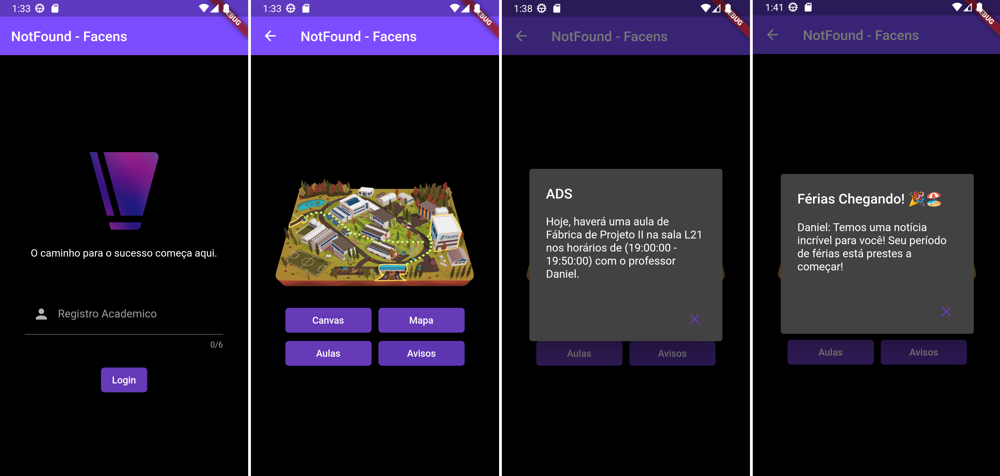
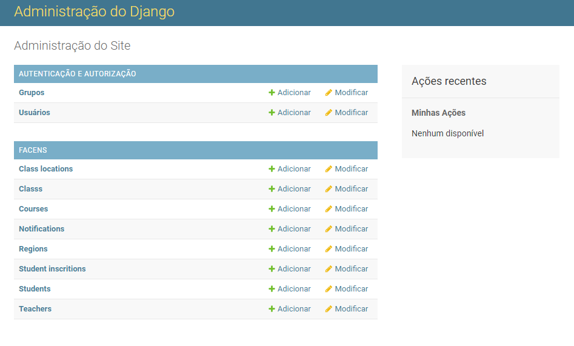

# 🎓 NotFound App (Segundo Semestre)

## 📘 Sobre o Projeto

O NotFound App é um inovador aplicativo criado a partir de Dart e Flutter, especificamente projetado com um objetivo primordial: unir compatibilidade universal com acesso fácil e direto aos dados acadêmicos de estudantes universitários. Nossa missão é abolir a necessidade de navegar por múltiplos sites e aplicativos, centralizando todas as informações de atividades acadêmicas em uma única plataforma. Por meio de uma simples busca pelo Registro Acadêmico (RA) do aluno, o NotFound App retorna todos os dados necessários, oferecendo uma solução amigável, intuitiva e robusta para a gestão de informações acadêmicas.



## 🔧 Como o App foi Construído

O NotFound App foi meticulosamente desenvolvido com a linguagem de programação Dart e a poderosa framework Flutter. Estas tecnologias foram escolhidas pela sua capacidade inigualável de desenvolvimento multiplataforma a partir de um único código-base, garantindo que o nosso aplicativo seja compatível com todas as plataformas existentes.

No coração do nosso sistema está uma conexão segura e eficiente com um servidor externo, desenvolvido com Django. Este servidor possui uma API robusta, projetada para fornecer informações acadêmicas específicas do aluno utilizando somente o seu Registro Acadêmico (RA). Dados como aulas, notificações e outras informações relevantes são obtidos diretamente deste servidor, consolidando todas as informações necessárias em um único lugar.

A experiência do usuário começa em uma tela de login intuitiva, onde o RA é inserido. Posteriormente, uma requisição POST é enviada para a API do servidor. Se o RA for validado com sucesso, o usuário é direcionado para a visualização de seus dados acadêmicos. Caso contrário, um erro é retornado, orientando o usuário a verificar o RA inserido. Esta interação fluida e segura garante que apenas estudantes validados tenham acesso às suas informações, mantendo a privacidade e a segurança dos dados.

## 💻 Tecnologias Utilizadas
- 🎯 Dart: Linguagem de programação adotada pelo Flutter.
- 📱 Flutter: Framework que viabiliza o desenvolvimento do aplicativo para iOS e Android.
- 📲 Emuladores Android e iOS: Ferramentas indispensáveis para o teste e simulação do aplicativo em diferentes dispositivos e sistemas operacionais.
- 🌐 API: Interface de programação de aplicações utilizada para facilitar a comunicação entre diferentes softwares.
- 🎨 Figma: Ferramenta de design utilizada para a criação e prototipação da interface do usuário.

## 📋 Requisitos para Utilizar o Sistema

Para conseguir executar o NotFound App no seu sistema, é essencial que você tenha os seguintes componentes instalados:

- 📱 Flutter & Dart ([Guia de Instalação](https://docs.flutter.dev/get-started/install))
- 🤖 Android Studio (Ambiente de desenvolvimento integrado - IDE)
- 🍏 XCode (Necessário para usuários do sistema operacional MacOS)
- 🌐 Servidor Facens-NotFound ([Guia de Instalação](https://github.com/FacensProjects/Facens-NotFound-Server#-como-usar))

Além destas instalações, é fundamental que você tenha uma compreensão básica de como operar a linha de comando no seu respectivo sistema operacional. Com estes pré-requisitos cumpridos, você estará preparado para executar e aproveitar todas as funcionalidades do NotFound App.

## 🌐 Servidor Facens-NotFound

O NotFound App é a peça chave do projeto NotFound e, para garantir seu pleno funcionamento, é indispensável a existência de um servidor local ou online para sua comunicação. Se você deseja configurar o servidor adequado para o aplicativo, consulte as instruções no nosso outro repositório [Facens-NotFound-Server](https://github.com/FacensProjects/Facens-NotFound-Server).



> ❗ **Atenção:** 
> Se você optar por hospedar o servidor Django online, será necessário realizar uma pequena alteração para garantir o funcionamento adequado do aplicativo. Acesse o arquivo **[notfound/lib/api.dart](notfound/lib/api.dart)** e atualize-o com o novo IP ou DNS do servidor online. Com essa modificação, o NotFound App torna-se verdadeiramente dinâmico, capaz de operar em qualquer local com acesso a dados móveis ou conexão com a internet. Assim, garantimos que você tenha todas as informações acadêmicas ao seu alcance, onde quer que esteja. 
>
> O seguinte código está configurado para uma aplicação local com o IP **10.0.2.2:8000** que vai funcionar normalmente caso você tenha um emulador e um servidor na mesma máquina. Caso queira torná-lo online, você deve trocar pelo IP ou DNS que estiver online. Veja o código a seguir:
> ```dart
> const String endSearch = "http://10.0.2.2:8000/api/v1/search/";
> ```

## 🚀 Como Usar

1. Primeiramente, clone o repositório usando o seguinte comando no terminal:

    ```sh
    git clone https://github.com/FacensProjects/Facens-NotFound-App.git
    ```

2. A seguir, entre na pasta do projeto com o comando:

    ```sh
    cd Facens-NotFound-App/notfound
    ```

3. Agora, instale as dependências do projeto utilizando o Flutter:

    ```sh
    flutter pub get
    ```

4. Após a instalação das dependências, você pode iniciar o aplicativo com o seguinte comando:

    ```sh
    flutter run
    ```

8. Agora você está pronto para utilizar o NotFound App.

## 👥 Desenvolvedores

- [WhitePoodleMoth](https://github.com/WhitePoodleMoth)

## 📄 Licença

O NotFound App é licenciado sob a Licença MIT. Veja o arquivo [LICENSE](LICENSE) para mais detalhes.
